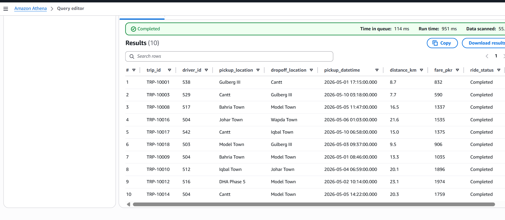

# Smart-Ride: Scalable Data Lake & Analytics Pipeline

## Project Overview
This project focuses on building a robust, end-to-end Data Engineering pipeline for a high-volume Ride-Hailing platform. The primary goal is to manage massive amounts of trip data, ensuring high availability, data quality, and ready-to-use analytics for business decision-making.

## Data Architecture (Medallion Approach)
The pipeline implements the "Medallion Architecture" to maintain a clean and reliable Data Lake on AWS:
* Bronze Zone (Raw Layer): Immutable storage of raw CSV ride data ingested directly from source systems.
* Silver Zone (Cleansing Layer): Filtered and standardized data processed via AWS Glue (PySpark) to remove cancellations, clean schemas, and convert to Parquet format.
* Gold Zone (Curated Layer): Aggregated business-level tables optimized for high-speed serverless SQL querying and BI Dashboards using AWS Athena.

## Technical Ecosystem
* Language: Python 3.x (Data Generation & PySpark)
* Distributed Computing: AWS Glue (Serverless ETL)
* Cloud Storage: Amazon S3 (Object Storage)
* Query Engine: Amazon Athena (Serverless SQL) / AWS Glue Data Catalog (Crawlers)
* Version Control: Git & GitHub

## Key Implementations

1. Data Ingestion & Storage (Bronze Zone)
The initial phase involves simulating real-world ride logs from Lahore (pickup/dropoff, fares, distance) and ingesting them into the S3 Bronze bucket. This ensures we have an immutable "Source of Truth" before any transformation.


2. ETL Processing (Silver Zone)
Using AWS Glue and PySpark, the raw data was transformed. The script filters out 'Cancelled' rides, handles missing values, and writes the clean data back to S3 in a highly compressed Parquet format to optimize query performance and reduce storage costs.



3. Business Intelligence & SQL Analytics (Gold Zone)
To extract actionable insights from the cleaned data, I utilized AWS Athena to run serverless SQL queries directly on the S3 Data Lake. 

--Overall Performance Metrics
This query provides a high-level summary of the platform's revenue and trip volume after data cleansing.

```sql
SELECT
    COUNT(trip_id) as total_successful_rides,
    SUM(fare_pkr) as total_revenue_pkr,
    AVG(distance_km) as average_distance_km
FROM silver;